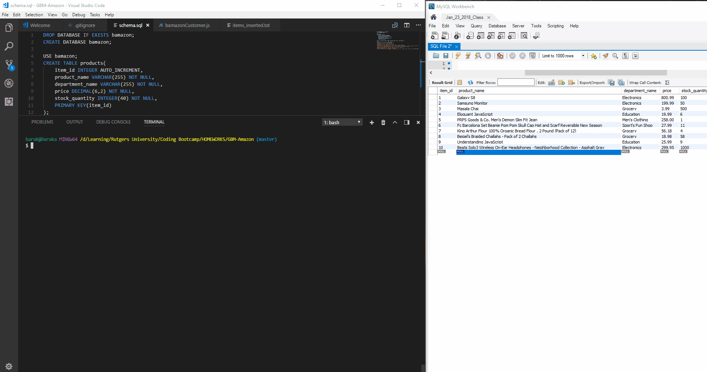

# GBM-Amazon

## Overview

This is an Amazon-like storefront made using MySQL and Node. The app will take in orders from customers and deplete stock from the store's inventory.
You will find three type of users. A _customer_, a _manager_ and a _supervisor_. Here is what you should expect from each user: 

#### USER #1: Customer View



A customer can buy items. This feature is available when you enter through ```bamazonCustomer.js``` and when it is run, this application will first display all of the items available for sale. The list includes the ```ITEM ID, PRODUCT NAME, and the PRICE``` of products for sale.

| ITEM NAME     | PRODUCT NAME    | PRICE  | 
| ------------- | --------------- | -------|
| 1             | Item 1          | 10.59  |
| 2             | Item 2          | 19.99  |

The customer is prompted to answer the following two questions:

   * What is the 'ITEM_ID' of the product you would like to buy?

   * How many units of the product would would like to buy?

The information entered by the customer is validated and will only allow numbers.

Once that data has been validated, the your application checks if the store has enough of the product to meet the customer's request.

   * If not, the app informs the customer that there is `Insufficient quantity!`.

However, if the store _does_ have enough of the product, the application fulfills the customer's order then:
   * Updates the database to reflect the remaining quantity.

   * Once the update goes through, the customer sees the total cost of their purchase.

#### USER #2: Manager View


A manager can also use this application from ```bamazonManager.js``` command. First, they will be presented with a list a set of menu options:
   * View Products for Sale

   * View Low Inventory  

   * Add to Inventory 

   * Add New Product

 * When a manager selects `View Products for Sale`, the app will list every available item: the item IDs, names, prices, and quantities.

 * When a manager selects `View Low Inventory`, then the app lists all items with an inventory count lower than five.

 * When a manager selects `Add to Inventory`, then app displays a prompt that will allow him/her to "add more" of any item currently in the store.

 * When a manager selects `Add New Product`, the app will allow the manager to add a completely new product to the store.

### User #3: Supervisor View

Finally, a supervisor can use the same application through the ```bamazonSupervisor``` command.
A supervisor will be presented with two options:

   * View Product Sales by Department

   * Create New Department

 * When a supervisor selects `View Product Sales by Department`, the app will display a summarized table in the terminal/bash window.
   The table will look something like this:

| department_id | department_name | over_head_costs | product_sales | total_profit |
| ------------- | --------------- | --------------- | ------------- | ------------ |
| 01            | Electronics     | 10000           | 20000         | 10000        |
| 02            | Clothing        | 60000           | 100000        | 40000        |

 * When a supervisor selects `Create New Department`, the app will allow the supervisor to add a brand new department, but the app will first check if that department already exist before it can update the database.

Comments are welcomed!